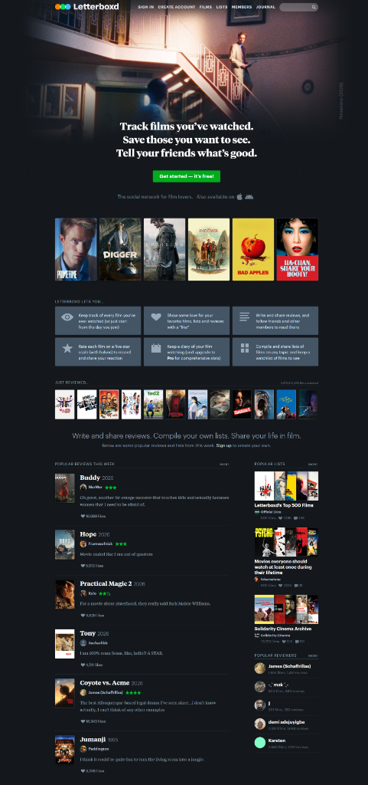
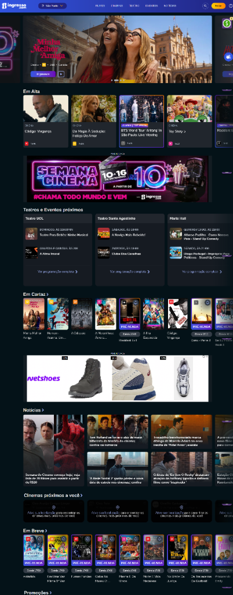
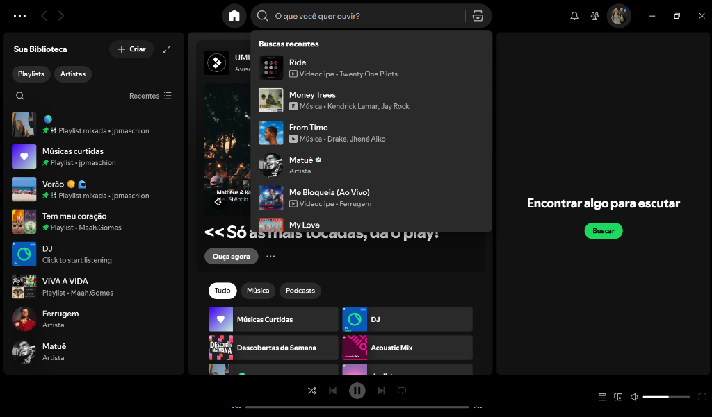
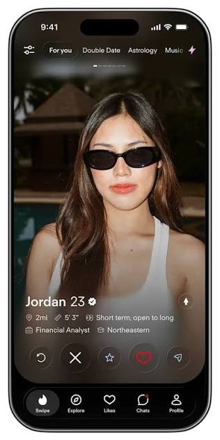

# References — CineLog (O Novo TV Time)

> **Checkpoint 1 — Web Development (2º Trimestre / 2026)**  
> **Instituição:** FIAP — Turma: 1ESPW  
> **Professor:** Caio Oliveira  
> **Integrantes:** João Pedro Sá e Gustavo Rezende Louro

## 1. Objetivo

As referências abaixo orientam as decisões de experiência, produto, arquitetura de informação e interface da nossa aplicação web, respondendo às dores reais identificadas com o encerramento do TV Time em 2026.

---

## 2. Referência 01 — Letterboxd

### Fonte

https://letterboxd.com/

### Imagem

### O que observamos?

O Letterboxd apresenta uma interface escura (dark theme) totalmente focada no pôster do filme, com um sistema de avaliação direta em 5 estrelas verdes, resenhas críticas da comunidade e catálogo limpo sem distrações visuais excessivas.

### O que vamos aproveitar?

- A identidade visual sóbria, elegante e cinematográfica.
- O componente de avaliação em 5 estrelas verdes para registrar a opinião pessoal do usuário.
- O formato de card vertical com proporção de cartaz de cinema (2:3).
- O campo para escrita e exibição de críticas/reviews pessoais.

### Como foi adaptado?

Criamos os componentes `MovieCard` e `StarRating` com superfícies sólidas escuras (`#161A20`) e destaque em verde Letterboxd (`#00E054`) para as estrelas de avaliação, além de um painel de resenha textual no componente `Details`.

---

## 3. Referência 02 — Ingresso.com

### Fonte

https://ingresso.com/

### Imagem

### O que observamos?

O Ingresso.com organiza os lançamentos e filmes em cartaz com clareza em seções temáticas, destacando a duração em minutos de cada obra (ex: `166 min`), classificação indicativa e ficha técnica direta.

### O que vamos aproveitar?

- O destaque explícito do tempo de duração do filme em minutos e horas formatadas.
- A divisão clara da tela em títulos "Em Alta / Populares".
- A apresentação objetiva da ficha técnica na página de detalhes.

### Como foi adaptado?

O dado de duração (`runtime`) dos filmes é extraído e exibido na página de detalhes e nos cards. Esse dado alimenta diretamente o nosso módulo que calcula quantas horas e dias de vida o usuário gastou assistindo produções audiovisuais.

---

## 4. Referência 03 — Spotify

### Fonte

https://open.spotify.com/

### Imagem

### O que observamos?

O Spotify possui um menu superior de navegação fixo com busca rápida acessível a qualquer momento, além de filtros ágeis por categorias e botões de ação com alto contraste.

### O que vamos aproveitar?

- O padrão do cabeçalho superior (`Navbar`) com campo de busca rápido e links das páginas.
- A navegação limpa e fluida sem recarregar a tela (SPA com React Router no modo data).
- A exibição de métricas rápidas de reprodução no topo da interface.

### Como foi adaptado?

Criamos um `Navbar` fixo no topo com campo de busca integrado com atalho `⌘K`, contador ao vivo de horas de tela e filmes assistidos, além de navegação para Home, CineMatch e Perfil.

---

## 5. Referência 04 — Tinder

### Fonte

https://tinder.com/

### Imagem

### O que observamos?

O Tinder utiliza o conceito de cards interativos deslizáveis (swipe), onde o usuário toma decisões rápidas de aceitar ("Like") ou recusar ("Dislike"), transformando a descoberta em um fluxo intuitivo e gamificado.

### O que vamos aproveitar?

- O modelo de interação "Swipe / Match" para recomendação e descoberta de filmes.
- Botões de ação rápida de "Passar" (X) e "Quero Assistir / Match" (Coração).
- A pilha visual de cartas com profundidade 3D.

### Como foi adaptado?

Criamos a página e módulo **CineMatch**, onde sugestões de filmes são exibidas como cartas empilhadas com carimbos visuais de ação ("QUERO ASSISTIR" e "PASSAR"), atalhos pelo teclado (setas) e uma fila lateral ("Fila CineMatch de Hoje") acumulando os filmes favoritados.

---

## 6. Referência 05 — Protótipo Google Stitch (Spec-Driven Development)

### Fonte

https://stitch.withgoogle.com/projects/17388927452232081278

### O que observamos?

Como parte da metodologia **Spec-Driven Development (SDD)** exigida no Checkpoint, desenvolvemos previamente um protótipo de alta fidelidade no **Google Stitch**, explorando a experiência completa do CineLog:

1. **Identidade Visual:** Logotipo oficial CineLog com badge vermelho de play, ponto verde de status ativo e paleta de cores sólida cinematográfica (`#0D0F12`, `#161A20`, `#212730`, `#E50914`, `#00E054`, `#F5C518`).
2. **Onde Assistir no Brasil:** Seção estruturada dividida entre _Incluso na Assinatura_ (Max, Prime Video, Netflix, Disney+, Apple TV+) e _Aluguel & Compra Digital_ (Apple TV, Google Play Filmes).
3. **Métrica Lendária:** Hero Card de "Horas de Vida Gastas" com divisão de Dias, Horas e Minutos, além de progress bars de imersão.
4. **Hall da Fama Pessoal:** Top 3 Atores Mais Assistidos com medalhas de Ouro, Prata e Bronze.

### Como foi adaptado?

A partir do protótipo gerado no Google Stitch, transcrevemos toda a arquitetura de informação e estilos visuais diretamente para **React com CSS Puro** (sem o uso de Tailwind, Axios ou bibliotecas proibidas), respeitando 100% dos padrões ensinados pelo Prof. Caio Oliveira na FIAP.
